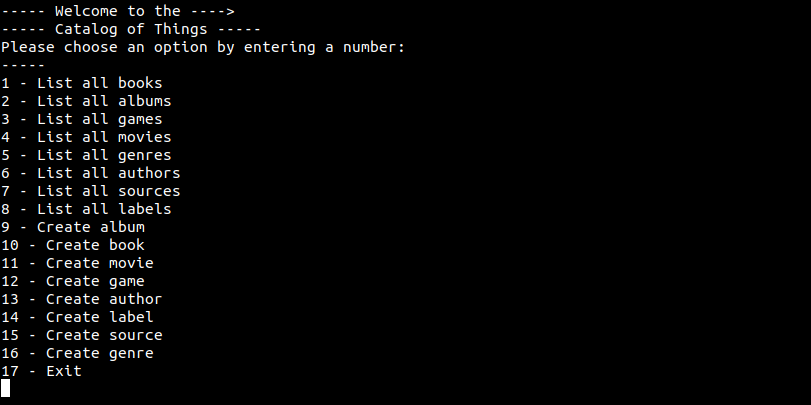

# Catalog of Things

Console App that will help you to keep a record of different types of things you won: books, music albums, movies, and games. The data will be stored in JSON files.

## Table of contents

- [Overview](#overview)
  - [Screenshot](#screenshot)
  - [Installation](#installation)
  - [Available Scripts](#available-scripts)
- [My process](#my-process)
  - [Built with](#built-with)
- [Authors](#authors)

## Overview

### Screenshot



### Documentation

Watch a video of us explaining how the app works and the main features.

[Video on loom](https://www.loom.com/share/aa97dca8a21241368852b4564dfe431e)

### Installation

- Clone this repository
```bash
$ git clone git@github.com:D4nielJ/catalog-of-things.git
$ cd catalog-of-things/
```

### Available Scripts

- Run the program
```bash
$ ruby main.rb
```

## My Process

### Built with

- Ruby

## Authors

**Daniel Jaramillo**
- GitHub - [@d4nielj](https://github.com/d4nielj)
- LinkedIn - [Daniel Jaramillo](https://linkedin.com/in/d4nielj) 

**Gabriel Rendon**
- GitHub - [@gabrielyea](https://github.com/gabrielyea)
- Linkedin - [Gabriel Rendon](https://www.linkedin.com/in/gabriel-rendon-paredes/)

**Alonso Falconi**
- GitHub - [@alonsofl](https://github.com/alonsofl)
- Twitter - [@AlonsoFalconi](https://www.twitter.com/AlonsoFalconi)
- LinkedIn - [Alonso Falconi](https://www.linkedin.com/in/alonsofalconi/)


## 🤝 Contributing

Contributions, issues, and feature requests are welcome!

Feel free to check the [issues page](../../issues/).

## Show your support

Give a ⭐️ if you like this project!
